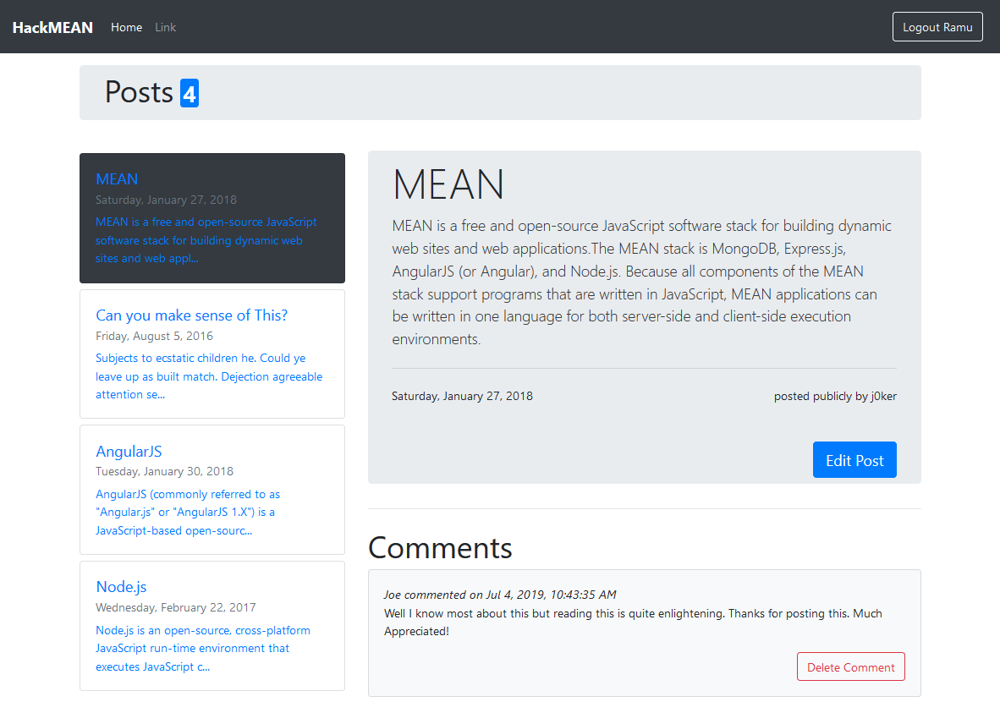

[](https://travis-ci.com/malikashish8/HackMEAN)

# HackMean

Intentionally vulnerable app built on MEAN stack (MongoDB, Express, Angular and Node.js). This app demonstrates common vulnerabilities in the MEAN stack. The challenge is find all the vulnerabilites by running the application (pentest) or by looking at the code (code-review) without reading [Vulnerabilites.md](./Vulnerabilites.md).



## Run with Docker Compose

With docker-compose you can run this application and mongodb in one go:

```bash
git clone https://github.com/malikashish8/HackMEAN.git --depth=1
cd HackMEAN
docker-compose up
```
## Run without Docker Compose
### Pre-requisites
- node.js
- npm
- MongoDB

### Installation
```bash
git clone https://github.com/malikashish8/HackMEAN.git
cd HackMEAN
npm install --production
npm start
```

## Develop
### Client Application

Code for the Angular application is available at [./hackmean-client](./hackmean-client). The client application has been build into `./public` folder and can therfore be accessed directly using HackMEAN at [http://localhost:8888/](http://localhost:8888).

Git hook to ensure that the client app is built for any changes to client code has been added to `.githooks/pre-commit`. This hook can be enabled by running:
```bash
git config --local core.hooksPath .githooks/
```